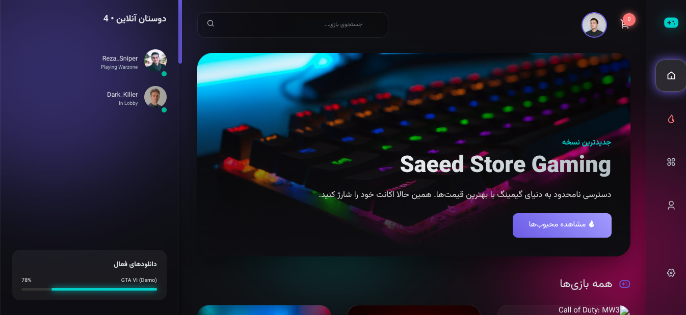

# 🎮 سعید گیم استور | پلتفرم نوین فروش بازی و پرداخت هوشمند

> یک پلتفرم تجارت الکترونیک با عملکرد بالا و استایل نئونی که برای تجربه خرید مدرن طراحی شده است. این پروژه تکنیک‌های پیشرفته frontend از جمله **شبیه‌سازی درگاه پرداخت امن**، **کارت‌های محصول گلس‌مورفیسم** و **یکپارچه‌سازی مدل‌های سه‌بعدی تجهیزات گیمینگ** را به نمایش می‌گذارد.

## 🌐 نسخه آزمایشی زنده
👉 **[برای مشاهده وب‌سایت زنده اینجا کلیک کنید](https://saeed-dev-ai.github.io/Payment-Gateway-Demo/)**

## ✨ ویژگی‌های کلیدی

این پروژه برای نشان دادن توانایی پیاده‌سازی زیرساخت‌های فروشگاهی با دقت بالا ساخته شده است:

- **🎬 لودینگ اختصاصی گیمینگ:** صفحه بارگذاری تعاملی که وضعیت اتصال به سرورهای فروشگاه و آمادگی درگاه پرداخت را شبیه‌سازی می‌کند.

- **💎 رابط کاربری Glassmorphism:** استفاده از جلوه‌های شیشه‌ای نئونی برای کارت‌های محصولات و سبد خرید که با محیط تاریک (Dark Mode) فروشگاه همخوانی کامل دارد.

- **💳 سیستم درگاه پرداخت (Simulated):** طراحی و کدنویسی جریان پرداخت (Checkout Flow) مشابه زرین‌پال، شامل دریافت اطلاعات مشتری و تایید تراکنش به صورت ایجکس.

- **🎧 ویترین سه‌بعدی محصولات:** استفاده از مدل‌های سه‌بعدی کنترلر و کنسول (Sketchfab) به عنوان پیش‌نمایش محصولات ویژه جهت افزایش تعامل کاربر.

**📱 کاملاً واکنش‌گرا:** تجربه خرید بدون نقص در تمامی دستگاه‌ها، از نمایشگرهای عریض دسکتاپ تا گوشی‌های هوشمند گیمینگ.

**⚡ عملکرد بهینه و سریع:** کدنویسی تمیز با HTML5، CSS3 و Vanilla JS بدون وابستگی به کتابخانه‌های سنگین، جهت تضمین سرعت لود زیر ۲ ثانیه.

توسعه یافته با ❤️ توسط **Saeed-dev-ai**
